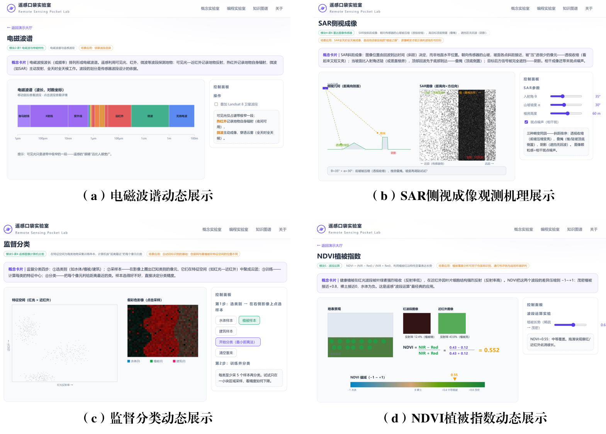
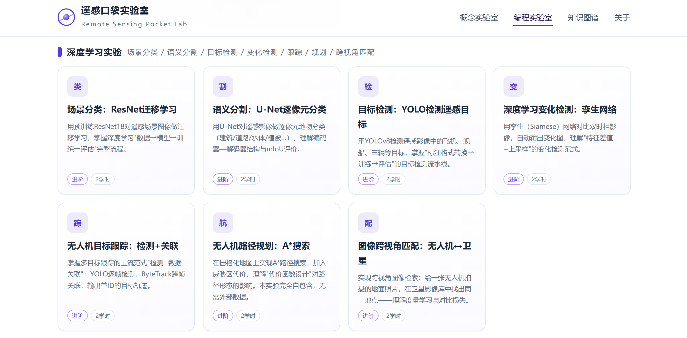

# 遥感口袋实验室（Remote Sensing Pocket Lab，RSPLab）

本页面是《遥感技术基础》课程配套的交互式学习网站，分三个部分：

- **概念口袋实验室**：覆盖全课程 **6个模块15次理论课、21个交互演示**，把电磁波、辐射传输、卫星轨道、SAR成像、计算机分类等抽象概念，做成可在浏览器里拖动、测量、探究的交互实验；
- **编程口袋实验室**：把概念变成上机实验—**16个实验教程**覆盖遥感图像处理基础（灰度值处理/NDVI/融合/平滑/锐化/K-means聚类）、深度学习七大任务（场景分类/语义分割/目标检测/变化检测/无人机跟踪/无人机路径规划/跨视角匹配）与大模型应用（多模态大模型/自然语言生成代码/辅助判读报告），每个实验标明**所需输入数据、处理步骤**，基础实验附**完整可运行代码**，进阶实验附**精选GitHub参考仓库**。
- **情景口袋实验室**：新增连接基础架构与综合演训的实践拓展层，按“伪装机理 → 目标识别 → 洪水监测 → 坐标定位 → 路径规划 → 综合融合”组织 **6 个情景任务**；每个任务均提供零数据合成运行、公开数据拓展、流程产物和 Low/Mid/High 三档 AI Prompt。
- **课程知识图谱**：按"信号-数据-信息-决策"知识链组织 **6个模块15次理论课、15个课次节点**，箭头标明概念间的逻辑关系与因果链条；点击节点查看知识点与配套资源（演示/实验一键跳转），并支持**按专业学习路径分强相关、中相关、弱相关三级高亮**（覆盖测绘工程、遥感科学与技术等6个专业）；下方**知识点串联图谱**把蕴藏在课次内的 **45个知识点**按“每章一个圆环”组织，环内圆点相连成链、环间箭头标明章节推进、跨环弧线标明跨章依赖，点击任一知识点查看释义与配套资源；






## 演示清单（21个，按课程章节）

| 章节 | 演示 | 核心交互 |
|---|---|---|
| 模块1 绪论 | 遥感过程全貌 | 能量脉冲沿"太阳→大气→地表→卫星→处理→应用"流动，点击环节看讲解 |
| 模块2 电磁波辐射特性及传输（3次课） | 电磁波谱 | 对数坐标谱带漫游，悬停查看波段用途，叠加 Landsat 8 真实波段 |
| | 大气窗口 | 逐成分（H₂O/CO₂/O₃…）开关大气吸收，看透过率曲线与大气窗口 |
| | 辐射传输过程 | 拖气溶胶/太阳天顶角/反射率，光子散射动画与能量逐级衰减 |
| | 黑体辐射与发射率 | 温度滑块看普朗克曲线变形；发射率滑块看实际地物辐射"打折" |
| | 地物波谱"身份证" | 点击场景地物生成波谱曲线，对比模式叠加，植被红边标注 |
| | 镜面反射与漫反射 | 粗糙度滑块改变反射分布（BRDF形状），观测角滑块体验方向反射 |
| 模块3 遥感平台（2次课） | 遥感平台与高度 | 从地面测量拖到卫星高度，视场覆盖与地面细节的权衡实时可见 |
| | 遥感卫星轨道 | 高度/倾角滑块，开普勒周期、星下点轨迹；SSO/极轨/MEO/GEO预设 |
| 模块4 成像传感器及图像特性（4次课） | 焦距·视场·分辨率 | 焦距滑块联动光路图、IFOV、GSD与幅宽 |
| | 摄影成像与投影差 | 框幅相机中心投影，楼高/航高滑块看"高楼向外倒" |
| | 传感器成像方式 | 摆扫式 vs 推扫式动画对比，看图像逐行"长"出来 |
| | SAR侧视成像 | 调入射角/坡度/楼高，统一斜距模型同时呈现透视收缩、叠掩、阴影与斑点噪声 |
| 模块5 遥感图像处理与分析（4次课） | 几何校正（GCP） | 拖动控制点对齐网格角，右侧实时重采样，RMS误差即时反馈 |
| | 直方图均衡化 | 一键对比原图/拉伸/均衡化，直方图与CDF同步变化 |
| | 图像判读标志 | 机场影像上开关七大判读标志标注，点击目标听判读思路 |
| | 图像融合（PAN+MS） | 全色+多光谱融合权重滑块，细节"渗入"彩色影像 |
| | 监督分类 | 点选样本看特征空间聚类，最小距离法整幅自动着色，精度即时评价 |
| | 非监督分类 | 零样本运行K-means：簇中心迭代收敛动画，"簇≠地物类别"对照真值一目了然 |
| | NDVI植被指数 | 拖植被长势，红/近红外反射率此消彼长，公式实时代入 |
| 模块6 遥感应用 | 变化检测·洪灾监测 | 拖动分割线对比灾前灾后，一键生成变化图（新增水体/受损建筑） |

## 编程口袋实验室实验清单（16个）

**A. 遥感图像处理基础实验**（附完整可运行Python代码，内置模拟数据零门槛可跑）
灰度值处理（直方图/2%拉伸/均衡化）· NDVI计算（波段运算）· 图像融合（Brovey变换）· 平滑滤波（均值/高斯/中值）· 锐化（拉普拉斯/USM）· K-means聚类（非监督分类）

**B. 深度学习实验**（关键代码骨架 + 数据集与GitHub参考仓库）
场景分类（ResNet迁移学习/NWPU-RESISC45）· 语义分割（U-Net/LoveDA）· 目标检测（YOLOv8/DIOR、DOTA）· 变化检测（孪生网络/LEVIR-CD）· 无人机目标跟踪（YOLO+ByteTrack/VisDrone）· 无人机路径规划（A*含威胁代价，完全自包含可运行）· 图像跨视角匹配（孪生网络+InfoNCE/University-1652）

**C. 大模型相关任务**
遥感多模态大模型零样本识别（RemoteCLIP/GeoChat）· 自然语言驱动代码生成· 大模型辅助判读报告生成

## 本地运行

无需安装任何东西，任选其一：

```bash
# 方式一：Python（推荐）
cd docs
python3 -m http.server 8000
# 浏览器打开 http://127.0.0.1:8000

# 方式二：直接双击 index.html 也能运行（纯静态、无跨域请求）
```

## 情景口袋实验室（Scenario Pocket Lab）

情景口袋实验室补充概念演示与编程实验，承接课内来不及完成的实践任务，提供课后自主拓展的浏览器工作台。默认数据均为浏览器本地生成的合成教学数据，并在结果区明确标注；页面不调用外部 AI API，也不会上传学员文件。

| ID | 任务与学习目标 | 可执行操作与实际输出 | 数据与状态 |
|---|---|---|---|
| S1 | 伪装光谱：比较植被、雪地、裸土与教学材料在 VIS/NIR/SWIR 的差异 | 调整季节、材料混合比例、扰动和曲线勾选；上传两列 CSV 曲线并按波长插值；计算 MAE/RMSE；导出 PNG、CSV、JSON | 合成光谱；上传 CSV 仅在浏览器本地处理；已实现 |
| S2 | 目标判读：学习影像判读标志和目标框标注 | 缩放画布、选择类别、手动画框、选择/删除标注；导出标注 PNG、target_list.csv/JSON | 合成航拍风格教学影像；本地 PNG/JPEG 可上传；未配置模型推理 |
| S3 | 洪涝变化：理解双时相指数分割与面积估算 | 选择 NDWI/MNDWI、波段映射、阈值和像元尺寸；生成前后水体掩膜、变化分类和面积统计；导出 PNG、CSV、JSON | 合成多光谱双时相数据；暂不支持 GeoTIFF 上传 |
| S4 | GCP 仿射定位：理解像素坐标到教学地图坐标的拟合残差 | 调整 GCP 数量和噪声、添加/删除控制点、输入目标像素；计算 6 参数、逐点残差和 RMSE；导出 PNG、CSV、JSON | 合成控制点；二维仿射教学演示，不等于 DEM 正射校正或外部定位精度 |
| S5 | 抽象栅格路径规划：区分 A* 路径搜索与任务访问顺序优化 | 调整障碍密度、代价权重、最近邻/2-opt 顺序；拖动任务点并运行 A*；导出抽象栅格 PNG、CSV、JSON | 非现实地理位置的合成网格；不提供 KMZ/KML、现实导航或部署建议 |
| S6 | 多源影像融合：比较空间细节与光谱信息权衡 | 选择 Brovey、IHS 强度替换或 PCA；执行上采样、融合和教学参考指标计算；导出 PNG、CSV、JSON | 合成 PAN/MS 与同源参考影像；真实影像上传暂未开放 |

### 使用方式与限制

- 使用现代桌面或移动浏览器打开 `index.html#/scenario`；GitHub Pages 使用仓库相对路径加载脚本。也可在仓库目录运行 `python3 -m http.server 8000` 后访问 `http://127.0.0.1:8000/index.html#/scenario`。
- 每个任务打开后可直接点击“使用内置样例”或“运行分析”。文件只在当前浏览器处理，上传大小限制为 8 MB；不支持的格式会显示错误，不会伪装成已处理。
- AI 区提供 Low/Mid/High 动态 Prompt，内容包含当前参数和实际计算摘要。请将 Prompt 粘贴到获准使用的 AI 工具，并人工核验输出。

### 后续计划

公开 GeoTIFF/光谱库接入、S2 可复现模型推理、S4 独立检查点、S6 真实数据配准与更完整的质量指标将在具备数据许可和前端解析能力后再开放。

## 目录结构

```
docs/
├── index.html              # 入口
├── assets/
│   ├── css/style.css      
│   └── js/
│       ├── main.js         
│       ├── coding-data.js  # 编程实验室：16个实验教程数据
│       ├── forum-data.js   
│       ├── forum.js        
│       ├── graph-data.js   # 知识图谱：15个课次节点
│       ├── graph.js        
│       ├── scenario-data.js # 情景实验室：S1-S6 任务元数据
│       ├── scenario.js      # 情景实验室：本地计算工作台
│       └── demos/          # 概念实验室：21个演示模块
│           ├── process.js      # 模块1：遥感过程全貌
│           ├── spectrum.js     # 模块2：电磁波谱
│           ├── atmosphere.js   # 模块2：大气窗口
│           ├── transfer.js     # 模块2：辐射传输
│           ├── blackbody.js    # 模块2：黑体辐射与发射率
│           ├── signature.js    # 模块2：地物波谱
│           ├── reflection.js   # 模块2：镜面/漫反射（BRDF）
│           ├── platforms.js    # 模块3：平台与高度
│           ├── orbit.js        # 模块3：卫星轨道
│           ├── optics.js       # 模块4：焦距·视场·分辨率
│           ├── camera.js       # 模块4：摄影成像与投影差
│           ├── scanner.js      # 模块4：摆扫/推扫成像
│           ├── sar.js          # 模块4：SAR侧视成像
│           ├── correction.js   # 模块5：几何校正（GCP）
│           ├── histeq.js       # 模块5：直方图均衡化
│           ├── interpret.js    # 模块5：图像判读标志
│           ├── fusion.js       # 模块5：图像融合
│           ├── classify.js     # 模块5：监督分类
│           ├── cluster.js      # 模块5：非监督分类（K-means）
│           ├── ndvi.js         # 模块5：NDVI波段运算
│           └── change.js       # 模块6：变化检测
└── README.md
```
